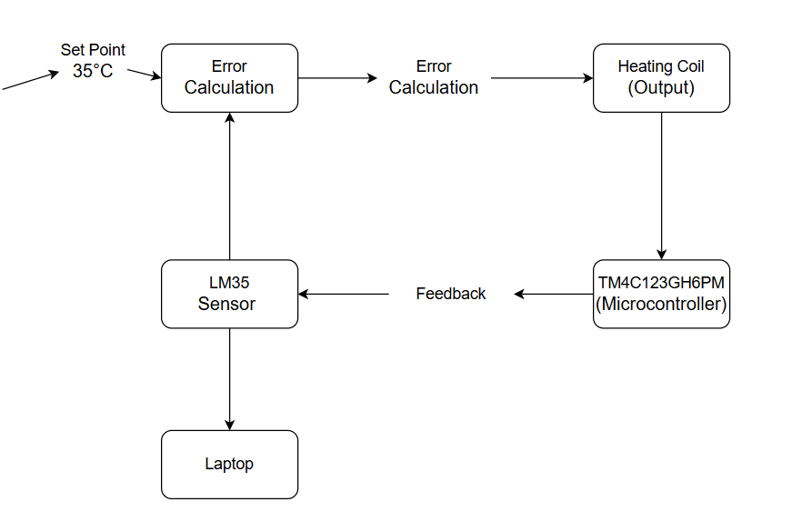
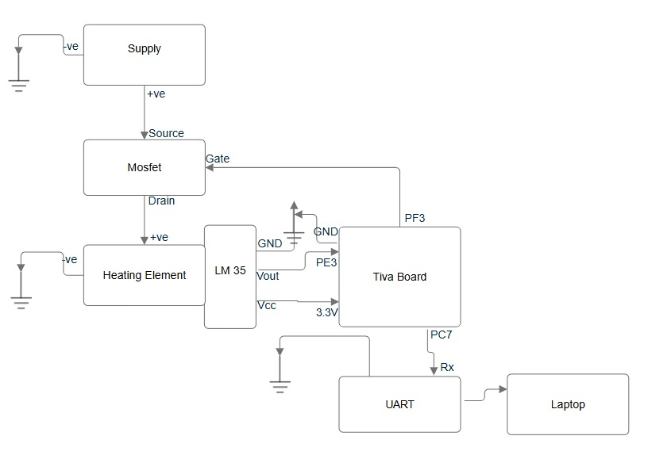

# ESD_Final_LabProject_Group15
Closed Loop PID Temperature Controller

# Project Title 
PID-Based Closed Loop Temperature Control System for Precise Temperature Maintenance

# Background 
Temperature regulation is critical in many industrial and laboratory applications, where specific temperatures must be maintained to ensure product quality, process efficiency, or safe working conditions.
Traditional temperature control systems may suffer from instability and overshoot, resulting in temperature oscillations. This project employs a closed-loop PID (Proportional-Integral-Derivative) control 
algorithm to achieve precise and stable temperature control, maintaining the target temperature around 35°C.

# Problem Statement 
This project addresses the need for a reliable temperature control system capable of:

1. Continuously monitoring temperature using a temperature sensor.
2. Maintaining the temperature around a setpoint of 35°C with minimal error.
3. Utilizing a PID algorithm to dynamically adjust the heating coil's power, reducing any temperature deviations in real-time.
4. Demonstrating effective control with minimal overshoot and oscillation, achieving a stable thermal environment.

# Solution
 Hardware Setup:
   1. A temperature sensor continuously monitors the current temperature.
   2. A heating coil serves as the system’s actuator, adjusting the heat output as needed to maintain the target temperature.
 PID Algorithm Implementation:
   1. The PID controller calculates the necessary adjustments by combining proportional, integral, and derivative actions to correct temperature discrepancies.
   2. The proportional term reduces the current error, the integral term eliminates residual steady-state error, and the derivative term anticipates future error trends for smoother control.
 Feedback Control Mechanism:
   1. The system operates in a closed loop, where temperature readings from the sensor provide feedback to the controller, allowing it to make real-time adjustments to the heating element.
   2. This feedback loop enables precise control over the temperature, minimizing fluctuations and maintaining stability around the setpoint.

# Block Diagram



# Circuit Diagram




# Pseudocode

The following pseudocode outlines the main functionality of the PID Temperature Control System:

```plaintext

// Initialize system & Set up PID parameters, sensor, and heater
initializeSystem()
  
while (systemActive) {
    currentTemperature = readTemperatureSensor()
    error = targetTemperature - currentTemperature
    
    // Calculate PID control output
    P = kp * error
    I += ki * error * deltaTime
    D = kd * (error - previousError) / deltaTime
    controlOutput = P + I + D

    adjustHeatingCoil(controlOutput)  // Apply control signal to heater

    previousError = error
    delay(deltaTime)  // Delay to control loop frequency
}
```

# Expected Outcome

The PID control system will accurately maintain the target temperature around 35°C, ensuring stable temperature control with minimal error. The system will effectively reduce overshoot and minimize temperature oscillations, providing a reliable and steady thermal environment.

# Applications

This temperature control system can be applied in scenarios where maintaining a stable temperature is crucial, such as:

   1. Laboratory experiments requiring a controlled environment
   2. Food processing systems
   3. Industrial manufacturing processes
   4. Greenhouse temperature management
